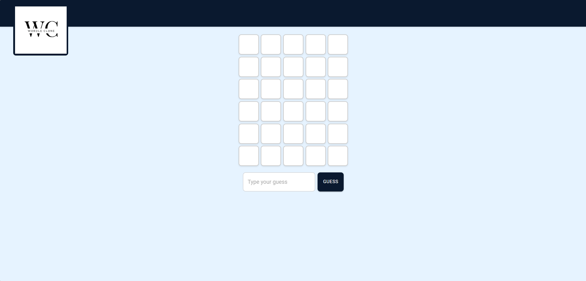

# Wordle clone



A short wordle clone that I made and designed using [Claude 3.5](https://www.anthropic.com/claude/sonnet) in under 1.5 hours

I used the basic `Vite` + `React` + `Typescript` + `Material UI` so claude would be to handle it well.
After the initial working product I did some changes and designing using it.

I created the logo in a random website that creates logos based on pre-made templates

The code uses 2 external APIs:

- [Dictionary API](https://dictionaryapi.dev/)
- [Random word API](https://random-word-api.herokuapp.com)

## Installation

1. Clone the repository:
   ```sh
   git clone https://github.com/yourusername/wordle-clone.git
   cd wordle-clone
   ```
2. Install dependencies:
   ```sh
   npm install
   ```
3. Start the development server:
   ```sh
   npm run dev
   ```
4. Open the app in your browser at `http://localhost:5173`

## Build for Production

To create an optimized production build, run:

```sh
npm run build
```
